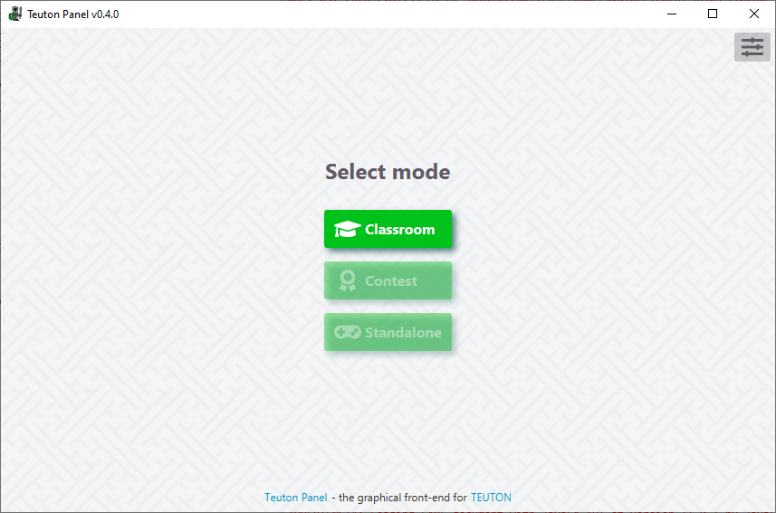
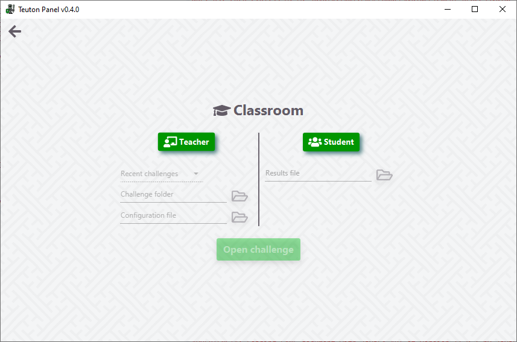
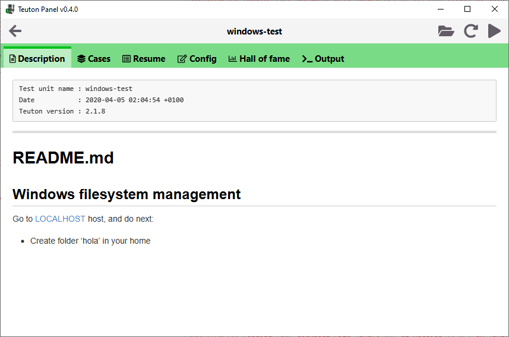
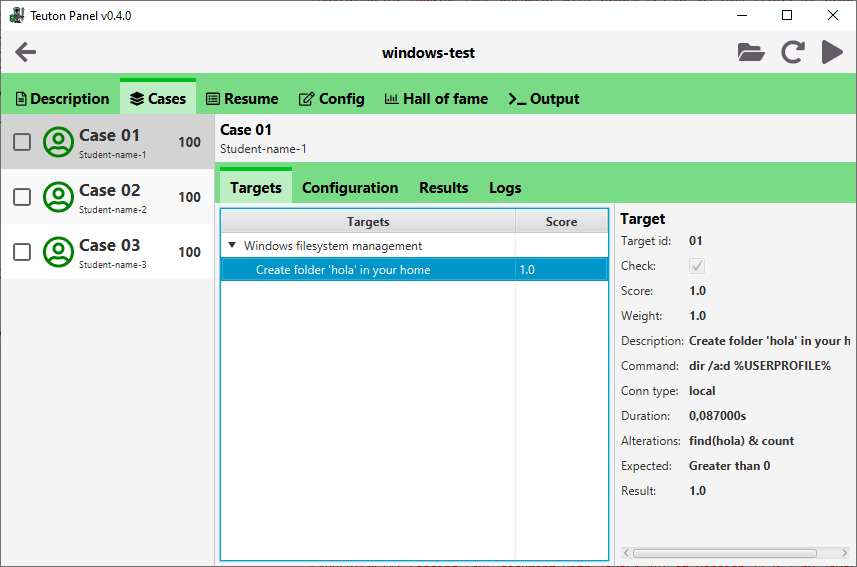
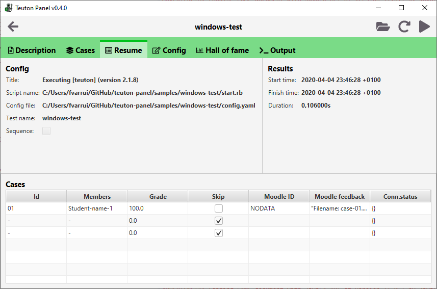
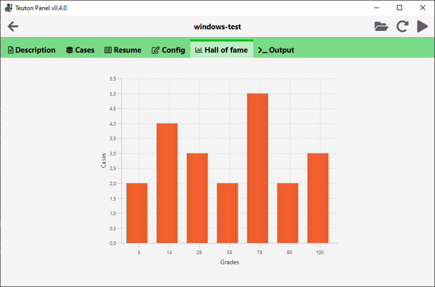
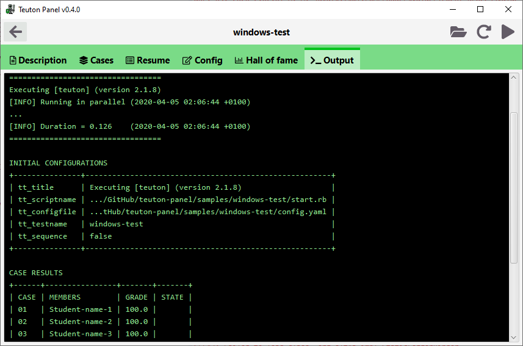

# Teuton Panel

**teuton-panel** is a graphical front-end for [teuton](https://github.com/dvarrui/teuton).

It includes [**teuton gem**](https://rubygems.org/gems/teuton) and uses [**jruby**](https://www.jruby.org/) to run it (so there's no need to install *teuton* separately nor Ruby).

- [**v0.4.0**](https://github.com/teuton-software/teuton-panel/releases/tag/v0.4.0) includes **teuton 2.1.8** and **jruby 9.2.9.0**

## For users

Download the appropriate installer for your platform from [releases](https://github.com/teuton-software/teuton-panel/releases), and install the application.

### Demo

[](https://youtu.be/nHlSKMy5728 "Teuton Panel v0 3 0 SNAPSHOT 2020 04 03 21 08 31")

### Mode (main screen)

On the first screen you can choose `teuton` mode.



### Classroom mode

Classroom mode can be used by teachers and students, each one has its section. Teachers can run tests to students machines and analyze results, and students only can analyze their results.

Teachers could choose a recently opened challenge or choose one with a specific config file (optional). If config file is not specified, it will use `config.yaml` file by default.



> :warning: At the moment it is only available for teachers.

#### Teacher mode

##### Header

In the header you have a button to **go back**, **challenge title**, a button to **open challenge folder** on system explorer, a button to **reload the results** from generated `json` files, and a button to **run the tests**.


##### Description

Description tab shows `README.md` file rendered as HTML. This files has to be located in the challenge  `assets` folder. If it's missing, it will be generated by `teuton`.



##### Cases

This tab shows the results by each case, whose information is obtained from the `case-*.json` files generated by teuton.

You can choose which cases will be tested in the list on the left, so only checked cases will be run when you push the play button.

> `*` corresponds to case identifier.



##### Resume

This tab shows a resume of the last cases results runned. It takes the information from the `resume.json` file, also generated by teuton. 



##### Config

This tab allows you to edit your challenge configuration.

> Comming soon!

##### Hall of fame

Shows a bar chart with cases results grouped by grade. Only available when there are 3 or more cases.



##### Output 

Shows output of the last execution of **teuton**.



## For developers

Requirements for building `teuton-panel`:

* [**OpenJDK**](https://adoptopenjdk.net/) (11+)
* [**Maven**](https://maven.apache.org) (3.5.4+)
* [**Inno Setup**](http://www.jrsoftware.org/isinfo.php) (5+): *to build EXE installer on Windows*

### How to build the application 

Execute next commands in BASH (GNU/Linux) or CMD (Windows):

1. Download source code and change to the project directory:

```bash
git clone https://github.com/teuton-software/teuton-panel.git
cd teuton-panel
```

2. Download and copy `rubygems` to resources:

```bash
mvn gem:initialize
mvn validate
```

3. Compile and package the project:

```bash
mvn package
```

It generates in `target`:

* A `teuton-panel_x.y.z.deb` package file on GNU/Linux. 
* A `teuton-panel_x.y.z.rpm` package file on GNU/Linux.
* A `teuton-panel_x.y.z.exe` installer file on Windows.
* A `teuton-panel_x.y.z.dmg` installer file on Mac OS X.

## Contributors

Thanks to the following contributors, who have provided patches and other assistance:

* **Javier Valencia Rodríguez**
