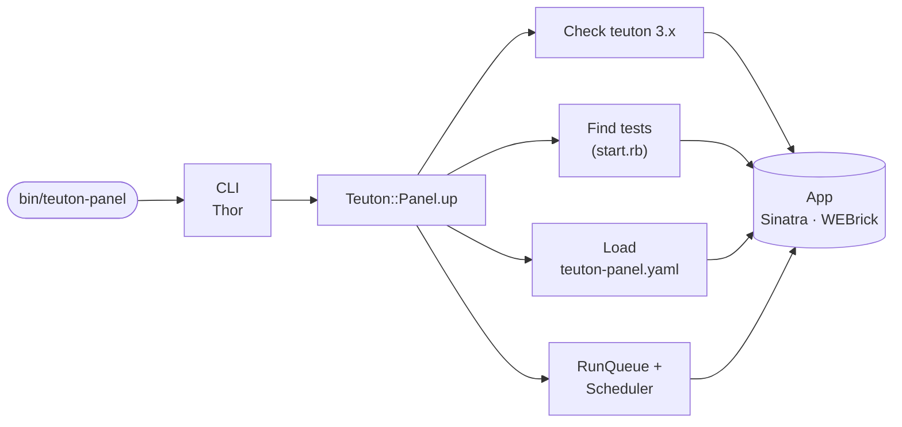
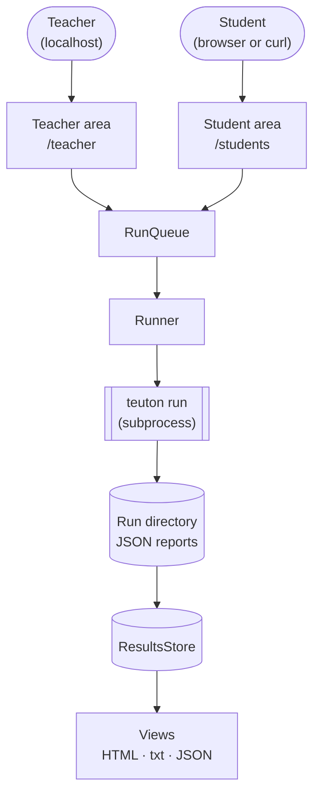
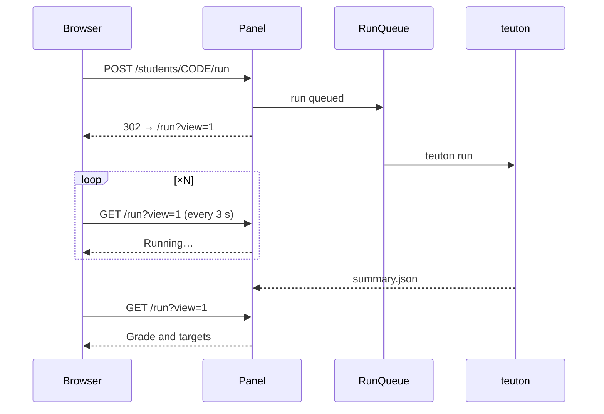

# Architecture
{: .no_toc }

1. TOC
{:toc}

## Flow

### Start

`teuton-panel up DIR` checks Teuton, finds the tests, loads the settings and starts the web app:

### Requests and runs

Every page reads the results store; runs go through the queue, and each one is a Teuton subprocess in its own directory:

### A student run in the browser

Post/Redirect/Get: the POST queues the run and the state page reloads itself, so reloading never runs the test twice.

## Main pieces (`lib/teuton/panel/`)

| File | Role |
| --- | --- |
| `cli.rb` | `up` and `version`; an unknown subcommand is a directory for `up` |
| `panel.rb` | Facade: check teuton, find tests, load config, select the test, wire the app, banner |
| `config.rb` | `teuton-panel.yaml`: defaults merged with the file, saved on every change |
| `project.rb`, `teuton_config.rb` | A Teuton test; reading `config.yaml` and adding `tt_include` as text |
| `params.rb`, `registration.rb` | Registration fields file; building and validating a student's values |
| `students.rb` | `config.d/<code>.yaml` registry: codes, create, update, disable, delete |
| `runner.rb`, `run_queue.rb` | Teuton as a subprocess; queue with teacher priority and parallel student runs |
| `results_store.rb`, `history.rb` | Latest result per student; run summaries |
| `scheduler.rb`, `sessions.rb`, `readme.rb` | Teacher runs; archived sessions; masked statement |
| `lang.rb`, `network.rb` | Translations; IP helpers |
| `app.rb`, `app/*.rb` | Sinatra core, teacher routes, student routes, view helpers |
| `views/`, `views/txt/`, `public/` | HTML views, plain-text views, CSS and fonts |

## Key decisions

- **Teacher area on localhost, student area on the LAN** (ADR-001): teacher routes answer loopback, the machine's own IPs and an allow-list.
- **Teuton as a subprocess** (ADR-002): Teuton's Ruby API keeps global state and exits on errors, so every run is a separate `teuton run` in its own directory. The panel never uses `tt_skip` or `--case`, which crash Teuton 3.0.0.
- **Plain Sinatra, keep it simple** (ADR-003): ERB views, plain CSS, OFL fonts served locally, no frontend build, WEBrick so nothing needs a compiler.
- **Personal codes** (ADR-004): students are identified by a code in the URL, not by IP.
- **Format by suffix** (ADR-005): `.txt` and `.json` on every student route; the teacher chooses which formats students get.

## Runs

Every run gets a directory `.teuton-panel/tests/<test>/runs/<id>/` with a temporary `config.yaml` that holds exactly the cases to run, each tagged with `tt_panel_key` (the student's code). After the run, the panel reads Teuton's `resume.json` and `case-NN.json`, writes a `summary.json` and updates the results store, which keeps the latest result of each student. Run directories are the history.

## Routes

- Root: `/` sends teacher addresses to `/teacher`, browsers to `/students` and answers `curl` with the plain-text help.
- Student area: `/students`, `/students/register`, `/students/readme`, `/students/<code>`, `/students/<code>/run`, `/results`, `/history`, `/status`; each with `.txt` and `.json`. In a browser, a run follows Post/Redirect/Get: the POST queues it and redirects to `/students/<code>/run?view=1`, which reloads itself until the result arrives. A `code` cookie remembers the student's code (`/students/forget` clears it).
- Teacher area: `/teacher`, `/teacher/tests`, `/teacher/registration`, `/teacher/students`, `/teacher/run` (its status lives in an iframe, `/teacher/run/status`, so the form is never reloaded), `/teacher/runs`, `/teacher/results`, `/teacher/moodle.csv`, `/teacher/readme`, `/teacher/settings`, `/teacher/sessions`.

The complete route map is in `.minispec/core/architecture.md`.
