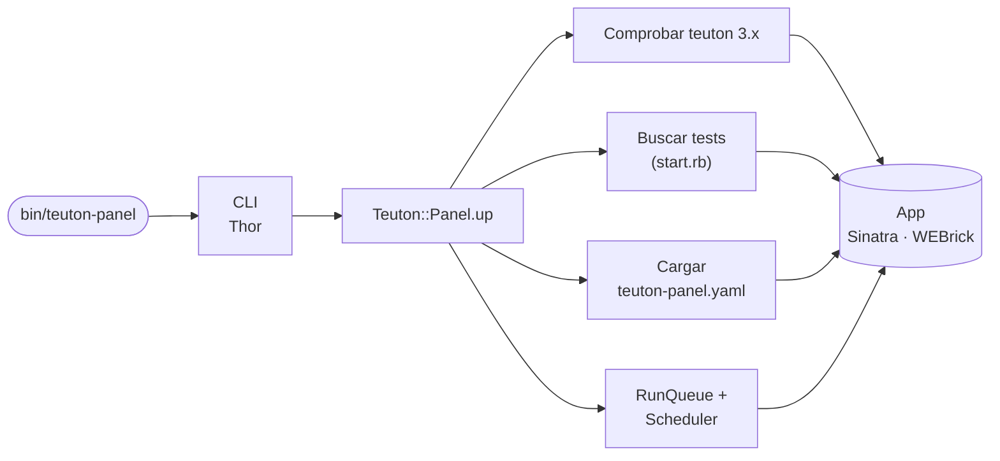
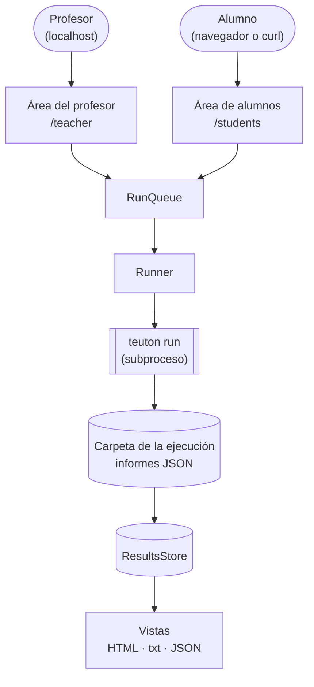
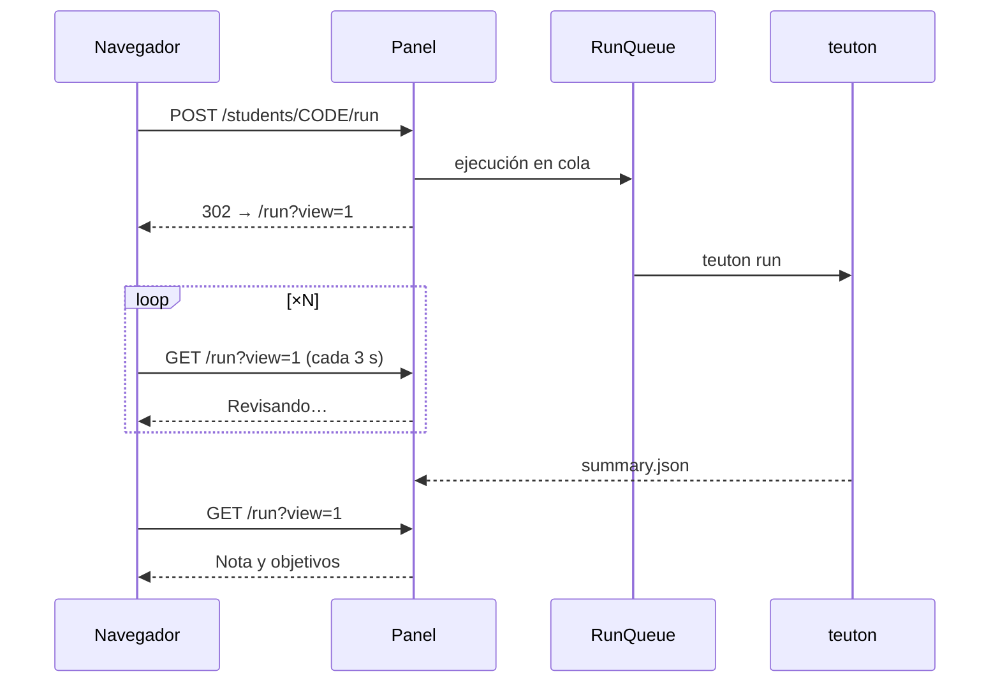

# Arquitectura
{: .no_toc }

1. TOC
{:toc}

## Flujo

### Arranque

`teuton-panel up DIR` comprueba Teuton, busca los tests, carga los ajustes y arranca la aplicación web:

### Peticiones y ejecuciones

Cada página lee el almacén de resultados; las ejecuciones pasan por la cola, y cada una es un subproceso de Teuton en su propia carpeta:

### Una ejecución de un alumno en el navegador

Post/Redirect/Get: el POST encola la ejecución y la página de estado se recarga sola, así que recargar nunca ejecuta el test dos veces.

## Piezas principales (`lib/teuton/panel/`)

| Fichero | Papel |
| --- | --- |
| `cli.rb` | `up` y `version`; un subcomando desconocido es una carpeta para `up` |
| `panel.rb` | Fachada: comprobar teuton, buscar tests, cargar la configuración, elegir el test, montar la app, banner |
| `config.rb` | `teuton-panel.yaml`: valores por defecto mezclados con el fichero, guardado en cada cambio |
| `project.rb`, `teuton_config.rb` | Un test de Teuton; leer `config.yaml` y añadir `tt_include` como texto |
| `params.rb`, `registration.rb` | Fichero de campos del alta; construir y validar los valores de un alumno |
| `students.rb` | Registro `config.d/<código>.yaml`: códigos, crear, actualizar, desactivar, borrar |
| `runner.rb`, `run_queue.rb` | Teuton como subproceso; cola con prioridad del profesor y ejecuciones de alumnos en paralelo |
| `results_store.rb`, `history.rb` | Último resultado de cada alumno; resúmenes de ejecución |
| `scheduler.rb`, `sessions.rb`, `readme.rb` | Ejecuciones del profesor; sesiones archivadas; enunciado sin contraseñas |
| `lang.rb`, `network.rb` | Traducciones; utilidades de IP |
| `app.rb`, `app/*.rb` | Núcleo Sinatra, rutas del profesor, rutas de alumnos, helpers de vistas |
| `views/`, `views/txt/`, `public/` | Vistas HTML, vistas de texto plano, CSS y fuentes |

## Decisiones clave

- **Área del profesor en localhost, área de alumnos en la red** (ADR-001): las rutas del profesor responden al loopback, a las IPs de la propia máquina y a una lista de permitidas.
- **Teuton como subproceso** (ADR-002): la API Ruby de Teuton guarda estado global y termina el proceso ante errores, así que cada ejecución es un `teuton run` aparte en su propia carpeta. El panel nunca usa `tt_skip` ni `--case`, que hacen fallar a Teuton 3.0.0.
- **Sinatra sencillo** (ADR-003): vistas ERB, CSS propio, fuentes OFL servidas en local, sin compilación de frontend, WEBrick para no necesitar compilador.
- **Códigos personales** (ADR-004): a los alumnos se les identifica por un código en la URL, no por su IP.
- **Formato por sufijo** (ADR-005): `.txt` y `.json` en todas las rutas de alumno; el profesor elige qué formatos reciben.

## Ejecuciones

Cada ejecución tiene una carpeta `.teuton-panel/tests/<test>/runs/<id>/` con un `config.yaml` temporal que contiene exactamente los cases a ejecutar, cada uno marcado con `tt_panel_key` (el código del alumno). Al terminar, el panel lee `resume.json` y `case-NN.json` de Teuton, escribe un `summary.json` y actualiza el almacén de resultados, que guarda el último resultado de cada alumno. Las carpetas de ejecución son el histórico.

## Rutas

- Raíz: `/` envía las direcciones del profesor a `/teacher`, los navegadores a `/students` y responde a `curl` con la ayuda en texto plano.
- Área de alumnos: `/students`, `/students/register`, `/students/readme`, `/students/<código>`, `/students/<código>/run`, `/results`, `/history`, `/status`; todas con `.txt` y `.json`. En un navegador, una ejecución sigue el patrón Post/Redirect/Get: el POST la pone en cola y redirige a `/students/<código>/run?view=1`, que se recarga sola hasta que llega el resultado. Una cookie `code` recuerda el código del alumno (`/students/forget` la borra).
- Área del profesor: `/teacher`, `/teacher/tests`, `/teacher/registration`, `/teacher/students`, `/teacher/run` (su estado vive en un iframe, `/teacher/run/status`, así que el formulario nunca se recarga), `/teacher/runs`, `/teacher/results`, `/teacher/moodle.csv`, `/teacher/readme`, `/teacher/settings`, `/teacher/sessions`.

El mapa completo de rutas está en `.minispec/core/architecture.md`.
